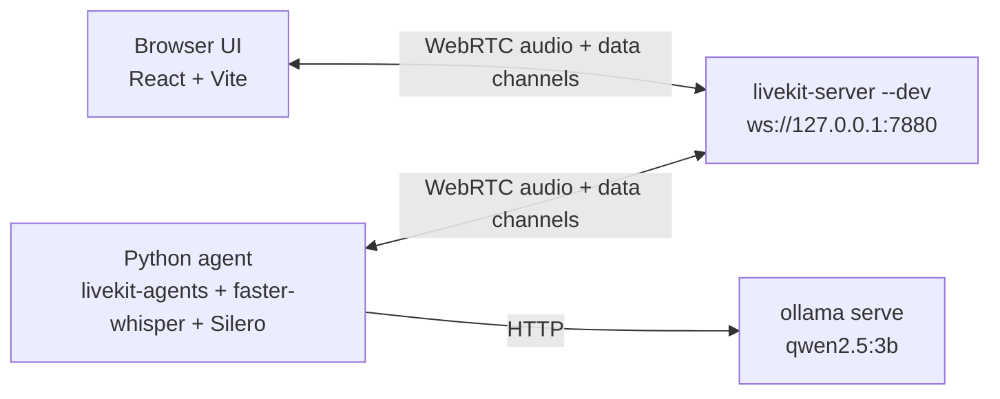

# Customer Service AI Coach — Design

> ⚠️ **Historical planning artifact.** This captures the design *as planned*.
> For what actually shipped, see [`docs/AS-BUILT.md`](../../AS-BUILT.md).

---

## Overview

Fully-local, browser-based, one-way practice tool for customer service reps. The rep picks a short scripted scenario, reads the rep turns aloud, and gets live coaching signals (fillers, pacing, dead air, prohibited phrases, text sentiment) plus LLM-generated supportive nudges. On Stop, an LLM narrative summary is appended and the session is downloadable as markdown.

**P0 constraints:** single-user, single-machine, no cloud. macOS primary, Linux secondary. CPU-only consumer laptop.

## Requirements

**Functional (P0)**
- Three local processes: LiveKit server, Python agent, React/Vite UI. Mic audio flows through LiveKit to the agent; agent publishes transcript/metrics/nudges back to the UI on WebRTC data channels.
- Explicit Start/Stop lifecycle. Tight-lane signals stream while running; an LLM nudge stream runs in parallel on a relaxed lane.
- Download-as-markdown on Stop: transcript + metrics + nudges + LLM narrative summary.
- User-configurable dead-air threshold, prohibited phrases, and pacing band. Persisted in `localStorage`; session data itself is ephemeral.

**Non-functional**
- Tight-lane latency (detectors → UI) < 500 ms.
- No cloud dependencies at runtime. No accounts. No persistent session data.
- One-time ~2.2 GB model download; no Docker required.

**Out of P0**
- Live customer calls, two-party audio, session history, authentication, TTS/speech-to-speech, admin features.

## Architecture



**Two lanes** — the shape the latency budget forces:

- **Tight lane (in-process, < 500 ms).** Audio → Silero VAD + `faster-whisper` STT → detectors → `MetricsSnapshot` → UI. Pure Python, no HTTP hops, no LLM.
- **Relaxed lane (async, seconds).** Detector events queue onto an `asyncio.Queue`; a single-concurrency worker calls Ollama and publishes nudges. A slow LLM response can never block the tight lane. End-of-session summary runs on the same worker after Stop.

## Components

| Area | Module | Responsibility |
|---|---|---|
| Agent | `stt/local_whisper.py` | In-process `faster-whisper` with a sliding 3 s window; Silero VAD drives finalization. |
| Agent | `detectors/{filler,pacing,prohibited,sentiment,dead_air}.py` | Tight-lane detectors; each consumes final transcripts and/or VAD events. |
| Agent | `pipeline/metrics.py` | `MetricsSnapshot` builder. Publishes on the `metrics` topic, rate-limited to one packet per 250 ms. |
| Agent | `pipeline/nudger.py` | Ollama-backed nudge worker, concurrency=1, event-triggered + periodic sweep. |
| Agent | `pipeline/summary.py` | End-of-session LLM narrative summary. |
| Agent | `transport/rpc.py` | `start_session`, `stop_session`, `update_settings`. |
| UI | `TranscriptPane` | Partial (italic) + final (solid) transcripts. |
| UI | `MetricsBar` | Live metric tiles. |
| UI | `NudgeStream` | Markdown nudge feed. |
| UI | `SettingsAccordion` | Settings → `localStorage` + debounced `update_settings` RPC. |
| UI | `DownloadButton` | Builds the markdown report client-side and triggers Blob download. |

## Agent ↔ UI contract

**Agent → UI (data-channel topics):**

| Topic | Cadence | Payload |
|---|---|---|
| `transcript` | per partial / final | `{ text: string, is_final: boolean }` |
| `metrics` | ≤ one per 250 ms (trailing-edge) | `MetricsSnapshot` — full state, not a delta |
| `nudges` | on LLM completion; also `{ event_type: "final_summary" }` on Stop | `Nudge { id, t_ms, text_markdown, event_type }` |

**UI → agent (LiveKit RPC):** `start_session(script_id)`, `stop_session()`, `update_settings(patch)`.

### MetricsSnapshot

```ts
type SentimentTag = "Positive" | "Neutral" | "Negative";
type PacingBand   = "slow" | "ok" | "fast";

interface MetricsSnapshot {
  t_ms: number;
  fillers_total: number;
  fillers_last: string | null;
  wpm_current: number;
  wpm_avg: number;
  pacing_band: PacingBand;
  prohibited_hits: number;
  prohibited_last: string | null;
  sentiment_tag: SentimentTag;
  sentiment_score: number;      // VADER compound, [-1, 1]
}
```

Sentiment bands: `Negative < -0.05 ≤ Neutral < 0.30 ≤ Positive`.

## Error handling (headline cases)

- **LLM offline / slow** — tight lane unaffected; nudger falls back to event-headline strings or skips on timeout.
- **Mic denied / LiveKit unreachable** — UI overlay with an actionable message.
- **Whisper hallucinations on silence** — RMS gate skips transcription on near-silence; a short string filter drops known YouTube-caption artefacts without swallowing fillers.
- **UI refresh mid-session** — session is ephemeral by design; a fresh room join starts a new session.

All detector state resets on `start_session`.

## Testing

- **Python unit** — each detector and the snapshot builder driven by synthetic event streams.
- **Integration (Python)** — feed a canned WAV with known filler / silence / prohibited content; assert approximate counts.
- **TypeScript unit** — data-channel parsers, hooks, and component rendering.
- **Manual E2E** — speak a short script with 3 fillers + a 4 s pause + 1 prohibited phrase; verify every tile and the nudge stream.

## Technology choices

| Area | Choice | Why |
|---|---|---|
| Transport | LiveKit (server + agents SDK) | User requirement; STT-only session supported. |
| Backend | Python | User requirement; best `faster-whisper` ecosystem. |
| Frontend | React + Vite + `@livekit/components-react` | Smallest viable footprint for a local SPA. |
| ASR | `faster-whisper base.en` int8 | CPU real-time within the 500 ms budget. |
| VAD | Silero (via `livekit-plugins-silero`) | Tiny, fast, first-class plugin. |
| LLM | Ollama + `qwen2.5:3b-instruct-q4_K_M` | OpenAI-compatible, CPU-fit, ~2 GB. |
| Prohibited-phrase match | Exact + `rapidfuzz.partial_ratio` | No model download; embeddings deferred to P0.5. |
| Sentiment | VADER | Zero download, microsecond inference. |
| Settings persistence | `localStorage` | Per-origin, ephemeral-enough. |
