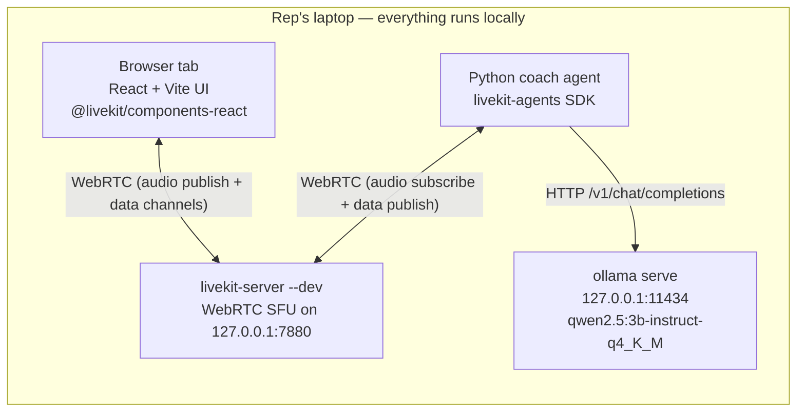
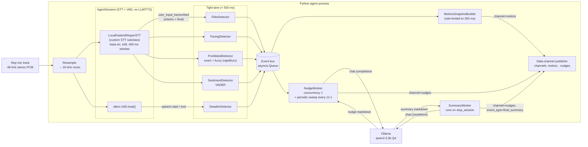
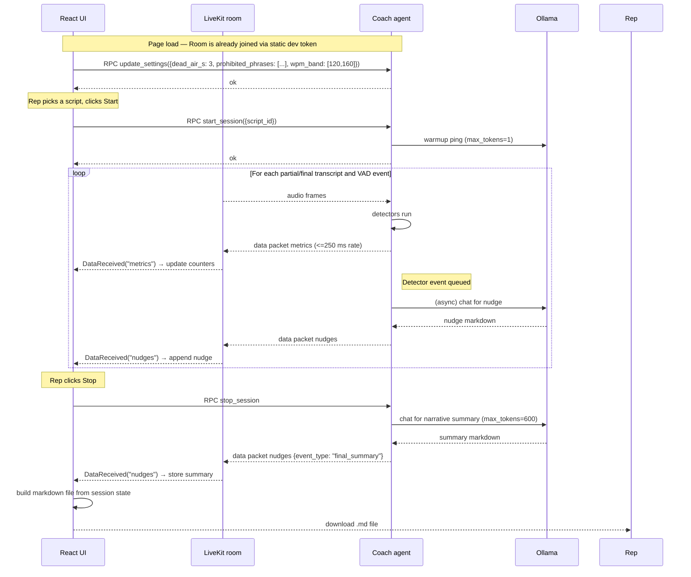

# Customer Service AI Coach — Detailed Design

**Project:** `customer-service-ai-coach`
**Status:** Design — reviewed 2026-05-07
**Repository target:** <https://github.com/Akash1684/customer-service-ai-coach>

---

## 1. Overview

Customer Service AI Coach is a **fully local, browser-based, real-time practice tool** for customer service representatives. Reps pick a prepared script from a small curated library, click Start, and read the **rep turns** aloud. The system captures the rep's microphone audio, streams it to a local Python agent via LiveKit WebRTC, and produces **live coaching feedback** (filler words, pacing, dead air, prohibited phrases, sentiment) as streaming UI metrics and **supportive, LLM-generated nudges**. At the end of the session the user downloads a markdown report with a narrative summary.

The product is intentionally **single-user, single-machine, zero-cloud** for v1 (P0). No data leaves the laptop; no accounts; no history. The full stack — ASR, LLM, VAD — runs locally.

### 1.1 High-level goals

- Deliver a minimum-viable live-coaching experience reps can actually use to self-correct.
- Stay faithful to the **LiveKit-based real-time architecture** so the same foundation supports future P1 work (live calls, customer-leg analysis, voice-role-play).
- Keep the dev setup **lean**: three services, ~2.2 GB one-time download, no Docker required.

### 1.2 Non-goals for P0

- Authentication, multi-tenant, or team features.
- Cloud deployment or SaaS hosting.
- Audio recording, session history, admin controls, or script authoring.
- Real customer calls (P1).

---

## 2. Detailed requirements

Consolidated from `idea-honing.md`. Organized as functional / non-functional / data.

### 2.1 Functional requirements (P0)

| # | Requirement | Source |
|---|---|---|
| F1 | Primary users are **customer service reps** practicing customer-interaction scripts. | Q1 |
| F2 | Product operates in **practice / rehearsal mode only** (rep reads a scripted interaction, no live customer). | Q3 |
| F3 | Audio pipeline is **one-way** — only the rep's microphone is captured and analyzed. | Q2 |
| F4 | The app ships with a **small curated library of 3–5 practice scripts** in **speaker-turn format with visible customer lines**. The rep reads only rep turns aloud; customer lines are shown as context. | Q11 |
| F5 | A session has a **manual Start / Stop** lifecycle. | Q8 |
| F6 | During the session, the system continuously produces real-time coaching signals: | Q2, Q12 |
|    | · **Filler words** (default list, user-editable) | |
|    | · **Pacing (WPM)** with configurable target band | |
|    | · **Dead air** with configurable silence threshold (default 3 s) | |
|    | · **Prohibited phrases** (user-editable list, exact + fuzzy match) | |
|    | · **Text-level sentiment** of the rep's transcript (VADER) | |
| F7 | The UI **streams continuously** with: live metric counters, live transcript pane, and a unified **LLM-generated nudge stream** that weaves detected events into supportive-coach language. | Q5, Q9 |
| F8 | The rep can **download the full session feedback** as a single **markdown file** on Stop. Contents: full transcript, metrics (totals + averages), event timeline, all nudges, and an LLM-generated **narrative summary**. | Q8, Q9 |
| F9 | The rep can **configure via the UI**: dead-air threshold, prohibited-phrase list, pacing band. Settings persist across refreshes in **`localStorage`**; session data does not persist. | Q10, Q13, Q14 |
| F10 | The UI and agent communicate bidirectionally through a **local LiveKit room**. Agent → UI uses WebRTC data packets on channels `metrics` and `nudges`. UI → Agent uses LiveKit **RPC** (`start_session`, `stop_session`, `update_settings`). | Derived (frontend.md) |

### 2.2 Non-functional requirements (P0)

| # | Requirement | Source |
|---|---|---|
| N1 | End-to-end feedback latency target **< 500 ms** for tight-lane signals. | Q7 |
| N2 | **Local-only deployment.** No external API calls during a session; no cloud infra. All inference on the rep's machine. | Q6 |
| N3 | **CPU-only target hardware.** Consumer laptop (8-core modern CPU, 16 GB RAM) should run P0 comfortably. | Q7 |
| N4 | **LiveKit is a firm architectural dependency.** | Q6 |
| N5 | **Backend: Python.** Frontend: recommended to be **React + Vite** with `@livekit/components-react`. | Q6 |
| N6 | **LLM stack: Ollama** locally; nudges and summary are LLM-generated (supportive coach, medium length). Nudge cadence is **event-triggered + periodic sweep**. | Q6, Q9, Q12 |
| N7 | **Minimal setup footprint.** 3 runtime services, ~2.2 GB first-run download, no Docker required. TTS / speech-to-speech pipelines are only pipeline-ready (not a P0 feature). | Q13 |
| N8 | All project artifacts (planning, code, docs) are published to `https://github.com/Akash1684/customer-service-ai-coach`. Fully open source. | Q6 |
| N9 | OS support: **macOS (primary), Linux (secondary)**. Windows via WSL2 untested in P0. | livekit-local-setup.md |
| N10 | No authentication or authorization. Single-user, single-session per machine. | Derived |

### 2.3 Data requirements (P0)

| # | Requirement | Source |
|---|---|---|
| D1 | No persistent storage of transcripts, audio recordings, sessions, or events. | Q8 |
| D2 | User settings persisted only in **`localStorage`** (dead-air threshold, prohibited phrases, pacing band). | Q14 |
| D3 | Session data exported only via **user-triggered markdown download**. | Q8, Q9 |
| D4 | Model artifacts (`faster-whisper`, Silero VAD, Ollama LLMs) cached in platform-standard locations (`~/.cache/huggingface`, Ollama model store). | local-asr.md |

---

## 3. Architecture overview

### 3.1 System context



### 3.2 Agent-internal pipeline



### 3.3 Session lifecycle (sequence)



### 3.4 Why this shape

- **Audio lives in LiveKit; control lives in the same LiveKit room.** We do not add a second websocket or REST layer for UI↔agent. Data packets and RPC over the existing WebRTC room are sufficient and idiomatic for the framework.
- **Detectors sit in-process with the STT.** The tight-lane latency budget is met by event-driven processing in the same Python task; no HTTP hops.
- **The LLM is outside the voice pipeline.** `AgentSession` has no `llm=` slot configured. The nudge worker is a separate `asyncio` task so a slow LLM response can never delay STT or detector emission.
- **Metrics are snapshots, not deltas.** Simpler UI: replace state on each packet; no reducers.

---

## 4. Components and interfaces

### 4.1 Python agent (server)

**Package:** `coach_agent/`

| Module | Responsibility |
|---|---|
| `main.py` | Entry point. Creates `AgentServer`, registers the RTC session entrypoint, wires up dependencies, starts LiveKit agents runtime via `cli.run_app`. |
| `stt/local_whisper.py` | `LocalFasterWhisperSTT` + `LocalFasterWhisperStream` — subclasses of `livekit.agents.stt.STT` / `SpeechStream`. Loads `base.en` `int8`. Implements 400 ms sliding-window streaming. Emits `INTERIM_TRANSCRIPT` / `FINAL_TRANSCRIPT`. |
| `detectors/filler.py` | `FillerDetector.on_transcript(event) -> list[DetectorEvent]`. Set-membership check on normalized tokens/bigrams. |
| `detectors/pacing.py` | `PacingDetector` — rolling 10-s-of-speech WPM + cumulative average. |
| `detectors/dead_air.py` | `DeadAirDetector` — subscribes to Silero VAD start/end events. |
| `detectors/prohibited.py` | `ProhibitedDetector` — exact + `rapidfuzz` fuzzy match, threshold 88. User-configurable list. |
| `detectors/sentiment.py` | `SentimentDetector` — `vaderSentiment`-based scoring on rolling transcript. |
| `pipeline/event_bus.py` | Thin `asyncio.Queue` wrapper with typed `DetectorEvent` dataclass. |
| `pipeline/metrics.py` | `MetricsSnapshotBuilder` — holds counters, composes snapshots, rate-limits to 250 ms. |
| `pipeline/nudger.py` | `NudgeWorker` — consumes event bus, rate-limits (1 per 5 s) + periodic sweep (every 12 s), calls Ollama. |
| `pipeline/summary.py` | `SummaryWorker` — invoked on `stop_session`, produces narrative summary. |
| `transport/publisher.py` | Wraps `room.local_participant.publish_data(..., topic=...)`. |
| `transport/rpc.py` | Registers RPC methods: `start_session`, `stop_session`, `update_settings`. |
| `scripts/library.py` | Hard-coded script library for P0. Three scripts with IDs and speaker-turn content. |
| `config.py` | `CoachSettings` dataclass. Defaults; merged with UI-provided patches. |

### 4.2 Key Python interfaces

```python
# detectors/base.py
@dataclass(frozen=True)
class DetectorEvent:
    type: Literal["filler", "pace_fast", "pace_slow", "dead_air",
                  "prohibited_phrase", "sentiment_dip", "positive"]
    t_ms: int                    # relative to session start
    detail: dict                 # type-specific metadata
    impact: Literal["low", "med", "high"] = "low"

class Detector(Protocol):
    def on_transcript(self, ev: stt.SpeechEvent) -> list[DetectorEvent]: ...
    def on_vad(self, vad_ev: VadEvent) -> list[DetectorEvent]: ...
    def snapshot(self) -> dict:  # contribution to the MetricsSnapshot
        ...
    def reset(self) -> None: ...
```

```python
# pipeline/nudger.py (sketch)
class NudgeWorker:
    def __init__(self, llm: openai.LLM, publish: PublishFn):
        self._llm = llm
        self._publish = publish
        self._last_nudge_t = 0.0
        self._last_sweep_t = 0.0
        self._state = RollingContext()

    async def run(self, event_bus: EventBus):
        async for ev in event_bus:
            self._state.absorb(ev)
            now = time.monotonic()
            if self._should_respond_to_event(ev, now):
                await self._emit(event=ev, now=now)
            elif now - self._last_sweep_t > 12:
                await self._emit(event=None, now=now)    # periodic
```

### 4.3 Frontend (`coach-ui/`)

See `research/frontend.md` for the full layout. Key components and their state:

| Component | Role | State inputs |
|---|---|---|
| `App.tsx` | Wraps `LiveKitRoom` with static dev token, handles connection lifecycle. | env vars |
| `CoachUI.tsx` | Top-level layout; owns session state + download trigger. | `useCoachSession()` |
| `ScriptPanel` | Renders selected script (speaker turns). | `selectedScript` |
| `MetricsBar` | Live counters (fillers, WPM, dead air, prohibited hits, sentiment pill). | `useMetrics()` |
| `NudgeStream` | Rolling markdown list. | `useNudges()` |
| `TranscriptPane` | Scrollable partial/final transcript. | `useTranscript()` |
| `SettingsAccordion` | Dead-air threshold, prohibited-phrase list, pacing band. Reads/writes `localStorage`. | `useSettings()` |
| `DownloadButton` | Serializes session state to markdown, triggers Blob download. | `useCoachSession()` |

`useCoachSession()` hook orchestrates:

```ts
type SessionState = {
  status: "idle" | "running" | "stopping";
  scriptId: string | null;
  startedAt: number | null;
  durationMs: number;
  metrics: MetricsSnapshot | null;
  events: DetectorEventUI[];         // from metrics.recent_events
  nudges: Nudge[];                   // including final_summary
  transcript: { partial: string; finals: TranscriptSegment[] };
};
```

### 4.4 RPC surface (UI → Agent)

| Method | Request | Response | Semantics |
|---|---|---|---|
| `start_session` | `{ script_id: string }` | `{ ok: true }` | Resets detectors, warms LLM, begins metrics emission. Any prior session state in the agent is cleared. |
| `stop_session` | `{}` | `{ ok: true }` | Stops emitting metrics, runs `SummaryWorker`, emits the final summary on `nudges` channel, then returns to idle. |
| `update_settings` | `Partial<CoachSettings>` | `{ ok: true, applied: CoachSettings }` | Merges UI patch into in-memory settings. Applies immediately to running detectors. |

### 4.5 Data channels (Agent → UI)

| Topic | Cadence | Payload |
|---|---|---|
| `metrics` | On detector firing, rate-limited to 250 ms | `MetricsSnapshot` (full state, not delta) |
| `nudges` | When the LLM finishes a nudge; also for `{ event_type: "final_summary" }` on stop | `Nudge` |

### 4.6 Dependencies summary

**Python agent (`pyproject.toml` headline deps):**

```
python = ">=3.10"
livekit-agents = "*"
livekit-plugins-silero = "*"
livekit-plugins-openai = "*"       # OpenAI-compatible client used against Ollama
faster-whisper = ">=1.0.3"
ctranslate2 = ">=4.3"
rapidfuzz = "*"
vaderSentiment = "*"
numpy = "*"
scipy = "*"                         # resampling
python-dotenv = "*"
```

**Frontend (`package.json`):**

```
react, react-dom, @livekit/components-react, @livekit/components-styles,
livekit-client, marked (markdown renderer), vite, typescript
```

---

## 5. Data models

### 5.1 Python-side types

```python
# config.py
@dataclass
class CoachSettings:
    dead_air_threshold_s: float = 3.0
    prohibited_phrases: list[str] = field(default_factory=lambda: [
        "I can't help you",
        "That's not my problem",
        "I don't know",
        "We never",
        "Always works",
        "Guaranteed",
    ])
    filler_words: list[str] = field(default_factory=lambda: [
        "um", "uh", "erm", "like", "you know", "so", "actually",
        "basically", "literally",
    ])
    wpm_band: tuple[int, int] = (120, 160)
    wpm_too_fast: int = 180
    wpm_too_slow: int = 100
    nudge_min_interval_s: float = 5.0
    sweep_interval_s: float = 12.0
```

```python
# pipeline/metrics.py
@dataclass
class MetricsSnapshot:
    t_ms: int
    session_id: str
    fillers_total: int
    fillers_recent: list[dict]              # last up-to-5 {word, t_ms}
    wpm_current: float
    wpm_avg: float
    dead_air_count: int
    dead_air_total_s: float
    prohibited_hits: int
    prohibited_recent: list[dict]           # {matched, snippet, t_ms}
    sentiment_tag: Literal["Positive", "Neutral", "Flat", "Negative"]
    sentiment_score: float
    recent_events: list[dict]               # last up-to-10 DetectorEvent dicts
```

```python
# transport/publisher.py (Nudge wire format)
@dataclass
class Nudge:
    id: str
    t_ms: int
    text_markdown: str
    event_type: Literal[
        "filler", "pace", "dead_air", "prohibited", "sentiment",
        "positive", "periodic", "final_summary"
    ]
```

```python
# detectors/base.py
@dataclass(frozen=True)
class DetectorEvent:
    type: str
    t_ms: int
    detail: dict
    impact: Literal["low", "med", "high"] = "low"
```

### 5.2 TypeScript mirrors (frontend)

```ts
// types.ts
export type Sentiment = "Positive" | "Neutral" | "Flat" | "Negative";

export interface MetricsSnapshot {
  t_ms: number;
  session_id: string;
  fillers_total: number;
  fillers_recent: { word: string; t_ms: number }[];
  wpm_current: number;
  wpm_avg: number;
  dead_air_count: number;
  dead_air_total_s: number;
  prohibited_hits: number;
  prohibited_recent: { matched: string; snippet: string; t_ms: number }[];
  sentiment_tag: Sentiment;
  sentiment_score: number;
  recent_events: DetectorEventUI[];
}

export interface DetectorEventUI {
  type: string;
  t_ms: number;
  detail: Record<string, unknown>;
  impact: "low" | "med" | "high";
}

export interface Nudge {
  id: string;
  t_ms: number;
  text_markdown: string;
  event_type:
    | "filler" | "pace" | "dead_air" | "prohibited" | "sentiment"
    | "positive" | "periodic" | "final_summary";
}

export interface CoachSettings {
  dead_air_threshold_s: number;
  prohibited_phrases: string[];
  filler_words: string[];
  wpm_band: [number, number];
  wpm_too_fast: number;
  wpm_too_slow: number;
}
```

### 5.3 Script library schema (P0)

```python
# scripts/library.py
@dataclass(frozen=True)
class Turn:
    speaker: Literal["customer", "rep"]
    text: str

@dataclass(frozen=True)
class Script:
    id: str
    title: str
    category: Literal["complaint", "inquiry", "cancellation"]
    turns: list[Turn]
    notes: str = ""
```

Library ships **3 scripts** in P0; authored during design (see §11 appendix).

### 5.4 Downloaded markdown file

Structure (produced client-side in `DownloadButton`):

```markdown
# Customer Service AI Coach — Session Report
**Script:** <title>
**Duration:** <mm:ss>
**Generated:** <ISO 8601>

## Metrics
- Total filler words: <n>   (breakdown: <word: n, ...>)
- Average pacing: <n> WPM   (target: <low>–<high>)
- Dead air: <n> events (<total>s)
- Prohibited-phrase hits: <n>   (list)
- Sentiment profile: <n>% Positive / <n>% Neutral / <n>% Flat / <n>% Negative

## Event timeline
- [mm:ss] <type> — <detail>
...

## Coaching nudges
- [mm:ss] <markdown nudge>
...

## Narrative summary
<LLM-generated markdown>

## Full transcript
<speaker-turn text with rep speech interleaved>
```

---

## 6. Error handling

The design handles faults at three boundaries: **model/service availability**, **real-time pipeline pressure**, and **UI/browser conditions**. Principles:

- **Degrade, don't crash.** Losing the LLM must not kill the session; losing the mic must not crash the agent.
- **Surface failures in the UI.** A small persistent status indicator shows tight-lane and relaxed-lane health.
- **Log structured errors.** Agent uses `structlog`-style key/value logs so issues can be reproduced from the log alone.

### 6.1 Fault matrix

| Fault | Detection | Behavior |
|---|---|---|
| Ollama not reachable at `start_session` | Warmup request fails | Session still starts; metrics and transcript work; `nudges` channel emits fallback `event_type` messages with **event headlines** only (e.g., `"Filler: 'um' at 00:22."`). UI shows a subtle banner: *"Live coaching tips unavailable — metrics still running."* |
| Ollama reachable but slow | NudgeWorker per-call timer > 8 s | NudgeWorker logs warning, skips current request, continues; rate-limiter naturally coalesces events. |
| Ollama returns malformed output | Output regex / length check | NudgeWorker post-processes (strip preamble, truncate to 35 words for event-nudges); if still invalid, drops. |
| `faster-whisper` model file corrupted / missing | Load fails on agent boot | Agent logs fatal error and exits with clear message to run `download-files`. |
| Whisper transcription slower than chunk cadence | Pipeline backpressure exceeds 2 chunks | `LocalFasterWhisperStream` drops oldest buffered chunk, logs `"dropped_audio_chunk"`. Optional fallback path: auto-switch to `tiny.en` if >30% chunks dropped for 10 s. |
| Silero VAD fails to load | Exception at boot | Agent logs fatal; session cannot run without VAD (dead-air detector relies on it). |
| Mic permission denied in browser | `LiveKitRoom` connect error | UI shows permission-denied overlay with instructions to grant access in browser settings. |
| WebRTC data channel disconnect | `Room` `disconnected` event | UI retries auto-reconnect (LiveKit does this); if persistently failed, shows a "Reconnecting…" banner and disables Start. |
| LiveKit server not running | WebSocket connect fails in browser | UI shows a pre-connect banner: *"Coach server not reachable at ws://127.0.0.1:7880 — did you run `livekit-server --dev`?"* |
| RPC `start_session` with unknown script_id | Agent returns `{ok: false, error}` | UI shows toast and reverts to idle. |
| UI refresh mid-session | Room rejoin with the same identity | Agent sees the session as effectively stopped; UI starts fresh. (Per Q8, session data is ephemeral; no recovery expected.) |
| `localStorage` unavailable (private window) | `try/catch` around read/write | Settings fall back to defaults for the tab; UI shows a subtle note: *"Settings won't persist in this window."* |

### 6.2 Status surface in UI

A small footer area renders three badges:

- **Room:** connected / reconnecting / disconnected
- **STT:** idle / streaming / degraded (dropped chunks)
- **Coach (LLM):** ready / slow / offline

These come from agent-side health pings published on a third topic `status` at 2 s cadence (while session is running). The design keeps this to an optional polish; if we don't build it, the absence is detectable from metric-packet staleness on the UI side.

---

## 7. Testing strategy

### 7.1 Test levels

| Level | Target | Tools |
|---|---|---|
| Unit | Detectors, settings merge, markdown builder | `pytest` (Python), `vitest` (TS) |
| Integration | Agent-level: feed a canned audio file → assert event sequence + metric snapshots | `pytest` + fixture WAVs |
| Manual E2E | Full pipeline: LiveKit server + agent + UI, recorded audio of a rehearsal | Browser + scripted walkthrough |

### 7.2 Unit tests

**Python detectors.** Given synthetic `stt.SpeechEvent` streams and `VadEvent` streams, assert:

- `FillerDetector` emits one event per filler, doesn't double-count on interim→final.
- `PacingDetector.wpm_current` recovers correctly when speaking pauses.
- `DeadAirDetector` honors the configured threshold; pre-session silence is ignored.
- `ProhibitedDetector` matches exact, fuzzy (minor typos), and is case-insensitive; misses unrelated strings.
- `SentimentDetector` tag transitions correctly at threshold crossings.

**Metrics snapshot builder.** Rate-limit does not skip events when quiet; coalesces during bursts.

**LLM nudger with mocked LLM.**
- Event-triggered path respects `nudge_min_interval_s`.
- Periodic sweep fires only in the absence of nearby events.
- Malformed LLM output is post-processed or dropped.

**TypeScript hooks.** `useDataChannel` mocks decode correctly; `useCoachSession` assembles state; markdown builder produces the documented structure.

### 7.3 Integration tests (Python)

- Load the agent without a real LiveKit connection (using the SDK's test harness) and drive it with a pre-recorded WAV file that intentionally contains 3 fillers, a 4-second pause, and 1 prohibited phrase. Assert the detector event sequence and final metric totals match expected.
- Mock Ollama with a static responder; assert nudges are published with expected event tags and cadence.

### 7.4 Manual E2E

Document a short checklist the developer runs before release:

1. Start `livekit-server --dev`, `ollama serve`, agent, UI.
2. Open the UI, grant mic, pick script #1.
3. Read intentionally: say "um" 3 times, include a 4-second pause, say "I can't help you" once.
4. Verify live counters and nudge stream reflect the events within reasonable delay.
5. Stop the session, download markdown, inspect structure.
6. Refresh the page; confirm settings (if changed) persist, session state does not.

### 7.5 Performance probes (optional but recommended)

- Log per-chunk STT latency; flag p95 > 400 ms.
- Log per-nudge LLM latency; flag p95 > 5 s.
- Log dropped audio chunks; flag >5% sustained.

---

## 8. Deployment / distribution (local testing only)

P0 is for local testing and demonstration, not distribution. The repository contains:

- `agent/` — Python agent package with `pyproject.toml` and `.env.local.example`.
- `coach-ui/` — Vite + React app with `.env.local.example`.
- `scripts/` — Dev scripts: `setup.sh` (install deps + download models), `start.sh` (run LiveKit server, agent, UI in a single pane tmux or plain background processes).
- `docs/` — Copy of the research notes and design doc for developer reference.
- `README.md` — One-pager with prerequisites (Python 3.10+, Node 20+, Ollama, LiveKit CLI), install steps, and how to run.
- `.github/` — Optional GH Actions for CI (lint + unit tests) later; not strictly P0.

Model weights (`faster-whisper base.en`, Silero VAD, Qwen 2.5 3B) are downloaded on first run, not committed.

---

## 9. Appendix A — Technology choices

| Area | Choice | Rationale | Alternatives considered |
|---|---|---|---|
| Real-time transport | **LiveKit** (server + agents SDK) | Firm user requirement (Q6). Rich plugin ecosystem, STT-only session supported. | OpenAI Realtime (cloud-only), raw WebRTC (too much glue code). |
| Backend language | **Python** | User requirement (Q6). Best ecosystem for `faster-whisper`. | Node (weaker ML ecosystem), Go/Rust (too bare). |
| Frontend framework | **React + Vite** | Simplest viable with `@livekit/components-react`; lightest bundle for local-only. | Next.js (too much server-side scaffolding for local dev), Svelte (less LiveKit SDK support). |
| ASR | **`faster-whisper` in-process, `base.en`, int8** | Best CPU real-time Whisper; fits `<500 ms` budget on consumer laptops. | Cloud STT (violates local-only), `whisper.cpp` (comparable; weaker Python streaming), HF `transformers` Whisper (too slow on CPU). |
| VAD | **Silero (via `livekit-plugins-silero`)** | First-class LiveKit plugin, tiny, CPU-fast. | WebRTC VAD (older, less accurate), custom energy-based VAD (noisy). |
| LLM | **Ollama, `qwen2.5:3b-instruct-q4_K_M`** | OpenAI-compatible API supported by LiveKit OpenAI plugin; easy model pull; best 3B CPU quality/speed balance. | `llama-server` (OK but more manual), cloud LLMs (violates local-only), 7B+ models (too slow on CPU). |
| Prohibited-phrase match | **Exact + `rapidfuzz`** | Tiny footprint, covers common variation. | `sentence-transformers` embeddings (deferred to P0.5 per user decision), full LLM classification (too slow). |
| Sentiment | **VADER (`vaderSentiment`)** | Zero-download, microsecond inference, acceptable for P0 rep-script context. | Distilled BERT (larger, needs PyTorch; deferred to P0.5). |
| Agent ↔ UI transport | **LiveKit data packets + RPC** | Already in the room; no extra sockets; idiomatic. | Separate WebSocket (more wiring), REST + SSE (more latency). |
| UI state for settings | **`localStorage`** | Simple, per-origin, exactly the scope we need. | IndexedDB (overkill), agent-side persistence (violates local-only ephemerality). |

---

## 10. Appendix B — Key research findings (distilled)

- **The LiveKit Transcriber recipe is the closest P0 template.** We reuse its STT-only session pattern and extend with detectors + nudge worker.
- **Two-lane architecture is the right shape** given `<500 ms` on CPU-only: detectors in-process for tight feedback, LLM-async for rich narrative.
- **`livekit-plugins-openai` talks to Ollama natively** — no custom LLM client needed. We instantiate `openai.LLM(base_url="http://127.0.0.1:11434/v1", model="qwen2.5:3b-instruct-q4_K_M")` directly from our nudge worker (not wired into `AgentSession.llm`).
- **`faster-whisper base.en` + int8 + 400 ms sliding window** fits the latency budget on a consumer CPU. Fallback to `tiny.en` for slower machines.
- **Data packets (metrics/nudges) + RPC (start/stop/settings)** are the full UI↔agent vocabulary. No additional transport.
- **Vite + `@livekit/components-react`** is the minimal React setup; heavier Next.js starter is unnecessary for a local SPA.
- **Total first-run download ~2.2 GB; no Docker required.**

Full research is retained in `research/` (six docs).

---

## 11. Appendix C — Script library (P0 content)

Three scripts, each 6–10 turns, speaker-turn format with visible customer lines. Drafted during the design phase per Q11/Q14b. Categories mirror common customer service scenarios.

### Script 1 — `complaint-billing`

**Title:** Billing dispute on a monthly plan
**Category:** complaint

| Speaker | Line |
|---|---|
| Customer | "Hi, I just saw a charge for $89 on my statement this month and I never agreed to that." |
| Rep | "I'm sorry for the confusion — let me pull up your account right now so we can look at this together. Could I have your account number, please?" |
| Customer | "It's 7742-AB-19. And this is really frustrating, I've been with you for five years." |
| Rep | "I hear you, and five years is a long relationship I don't want to lose. I'm looking at your account now… I can see the $89 charge you're referring to. It looks like it was a one-time adjustment from a plan change last month." |
| Customer | "I didn't change any plan." |
| Rep | "I understand. Let me check the history on that change and see exactly when it was made and by whom. While I do that, can you tell me if anyone else has access to the account — maybe a partner or family member?" |
| Customer | "Just me." |
| Rep | "Thanks for confirming. In that case, the change may have been applied in error on our side. I'd like to reverse it and credit the $89 back to your next bill. Would that work for you?" |
| Customer | "Yes, that would work." |
| Rep | "Perfect. I'll get that processed now. You'll see the credit on your next statement within seven business days. Is there anything else I can help you with today?" |

### Script 2 — `inquiry-account`

**Title:** Account plan inquiry and upgrade offer
**Category:** inquiry

| Speaker | Line |
|---|---|
| Customer | "Hi, I'm wondering what plans you have that include more data. I've been running out every month." |
| Rep | "Happy to help with that. Before I pull up plan options, can I get your name and the phone number on the account?" |
| Customer | "It's Jamie Park, 555-0140." |
| Rep | "Thank you, Jamie. I can see you're on the Essential 10 plan, which includes 10 gigabytes of data. Is that right?" |
| Customer | "Yeah, and I keep running out around the third week." |
| Rep | "That's a common pattern — and we have a plan that may be a better fit. Our Flex 30 plan gives you thirty gigabytes for about fifteen dollars more than what you're paying now. Would you like to hear a bit more about it?" |
| Customer | "Sure." |
| Rep | "Great. Flex 30 also includes unlimited streaming for video services, which many customers find covers the bulk of their data use. If you'd like to try it, I can switch your plan today and prorate the difference for this month, so you only pay for the days you use it. Would you like me to proceed?" |
| Customer | "Let's do it." |
| Rep | "Wonderful. I'm making the change now. You'll get a confirmation text within the next few minutes. Is there anything else I can help you with today?" |

### Script 3 — `cancellation-retention`

**Title:** Service cancellation — retention
**Category:** cancellation

| Speaker | Line |
|---|---|
| Customer | "Hi, I'd like to cancel my service. I'm just using it too little to justify the cost." |
| Rep | "I appreciate you letting me know. Before we process the cancellation, would you mind if I asked a couple of quick questions so I understand what's going on? It'll only take a minute." |
| Customer | "Okay, sure." |
| Rep | "Thank you. You mentioned the cost — is it more about the monthly price, or the value you feel you're getting from what you're using?" |
| Customer | "Honestly, both. I barely use the data and I'm paying thirty-five dollars a month." |
| Rep | "That's a fair concern, and you shouldn't be paying for what you don't use. We actually have a light-use plan that's fifteen dollars a month with five gigabytes included. That's less than half of what you're paying now, and it keeps your number and account history intact. Would you like to hear a little more about it before we make any changes?" |
| Customer | "That actually sounds better than cancelling." |
| Rep | "I'm glad it sounds useful. I can switch you to the light-use plan today, and the change will be effective from your next billing cycle. If you find later that you need more, we can move you back up at any time with no fee. Would you like me to make the switch?" |
| Customer | "Yes please." |
| Rep | "Done. You'll receive an email confirming the change. Thanks for giving us a chance to keep your service — is there anything else I can help you with?" |

---

## 12. Appendix D — Alternatives considered and rejected

- **Cloud-hosted SaaS.** Rejected: user requirement is local-only (Q6).
- **Cloud LLM with local STT.** Rejected: same reason; all inference must be local.
- **Self-hosted LiveKit via Docker Compose.** Rejected for P0: native `livekit-server --dev` binary is simpler; Compose adds Docker dependency unnecessarily.
- **TTS / speech-to-speech in P0.** Rejected per Q12: stack-ready only. Deferred to future iterations.
- **Customer-leg (two-party audio) analysis.** Rejected per Q2: one-way audio only for P0.
- **Storage of sessions, audio recordings, history.** Rejected per Q8: P0 is ephemeral.
- **Auth / user accounts.** Rejected: single-user local.
- **LLM on the tight lane.** Rejected: incompatible with `<500 ms` on CPU.

---

## 13. Appendix E — Open items (to be finalized during implementation)

- **Exact `faster-whisper` streaming shape** — the `STT` subclass design in this document is the intended contract, but the precise chunk cadence and overlap are best tuned via a prototype. Step 1 of the implementation plan will validate this.
- **Nudge prompt iteration** — the prompts in `research/local-llm.md` are v1; they'll likely need 1–2 rounds of refinement against real recordings.
- **Script library polish** — the three scripts in Appendix C are reasonable first drafts; may need light editing after testing with real reps.
- **Status topic UX** — optional `status` data channel for STT/LLM health badges; lands in P0 only if implementation time allows.
