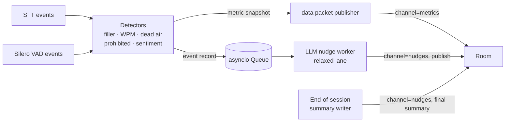

# Research: Tight-lane detectors

**Scope:** Implementation patterns for the five P0 coaching signals — filler words, pacing (WPM), dead air, prohibited phrases, and text-level sentiment — all running in-process on the streaming ASR output with sub-millisecond detector overhead.

**Date:** 2026-05-07

---

## 1. Design principles (shared across detectors)

- **Event-driven.** Each detector subscribes to `user_input_transcribed` and/or Silero VAD events. No polling.
- **Stateful within a session, stateless across sessions.** Totals reset on `start_session`.
- **Emit two things:**
  1. A **metric snapshot** on every detector firing (pushed to `metrics` data channel for the UI counters).
  2. An **event record** on the internal `asyncio.Queue` that feeds the LLM nudge worker.
- **Zero blocking work.** All heavy lifting (LLM, embeddings) stays off the detector path. Detectors do regex, counting, and small lookups.

---

## 2. Filler words

### Definition

Words the rep says that mark hesitation and read as unconfident. Default list:

```python
FILLERS = {"um", "uh", "erm", "like", "you know", "so", "actually", "basically", "literally"}
```

Configurable from the UI (same pattern as prohibited phrases); default seeded to the above.

### Algorithm

1. On each `user_input_transcribed` event (both interim and final), tokenize the **new words since last event** (track an `offset` cursor).
2. For each new token or bigram, normalize (`.lower().strip(".,!?")`) and check membership in the filler set.
3. Increment `fillers_total`; emit an event `{type: "filler", word, t_seconds}`.

Only count each word once by matching on the **final** transcript for the segment to avoid double-counting during interim revisions. Use interim transcripts to compute *tentative* counts for the live UI, then reconcile on final. Simpler alternative used in P0: **count only on final transcripts** and accept ~1 s delay in the filler counter. Given our streaming cadence this is a fine tradeoff.

### Cost

Set membership O(1) on ≤ 20 items → negligible.

---

## 3. Pacing (words per minute)

### Definition

WPM computed over a rolling window; normal-range band shown on the UI.

### Algorithm

Two metrics:
- **`wpm_current`** — rolling WPM over the last **10 seconds of speech** (not wall-clock), updated on every transcript event.
- **`wpm_avg`** — cumulative WPM since session start, averaged over all speaking time.

Implementation:

```python
# On user_input_transcribed (final)
new_word_count = len(normalize(text).split()) - last_word_count
new_speech_seconds = final_end_time - final_start_time
window.append((now, new_word_count, new_speech_seconds))
# evict entries older than 10s of speech
words_10s, seconds_10s = sum_window(window)
wpm_current = 60 * words_10s / max(seconds_10s, 0.1)
```

### Targets and events

- **Target band:** 120–160 WPM (broadly used customer-service guidance).
- **Too fast:** `wpm_current > 180` sustained for 5 s → emit `{type: "pace_fast"}`.
- **Too slow:** `wpm_current < 100` sustained for 5 s **and** rep is currently speaking → emit `{type: "pace_slow"}`.

The **band edges are configurable** in the UI. P0 ships with the defaults above.

---

## 4. Dead air

### Definition

Rep is silent too long during a session.

### Algorithm

Subscribe to Silero VAD events.

- On `END_OF_SPEECH`, record `silence_start = now`.
- On `START_OF_SPEECH`, compute `silence_duration = now - silence_start`. If `silence_duration >= dead_air_threshold_s` (default `3.0`, configurable in UI), emit `{type: "dead_air", duration_s, t_seconds}` and increment `dead_air_count`.
- On `start_session` we mark the "before-first-speech" period as **pre-session** and do not count it.
- On `stop_session`, any ongoing silence is recorded but capped at session end.

### Why Silero and not silence-from-transcripts

VAD gives millisecond-precision speech boundaries before ASR finalizes. Using transcript gaps would underreport (STT smooths short pauses) and be late.

### UI surface

- Live counter: `Dead air: 3 events (8.4s total)`.
- Toast-style nudge at each event (LLM-written nudge arrives a few seconds later).

---

## 5. Prohibited phrases

### Definition

A user-configurable list of phrases the rep should avoid. Case-insensitive.

### P0 algorithm — exact + fuzzy (no embeddings)

1. **Exact / substring match** on normalized text (lowercased, whitespace-collapsed, punctuation stripped):
   - Fast scan over the phrase list on each final transcript.
2. **Fuzzy match** as a fallback for minor variations ("don't know" vs "dont know" vs "do not know"):
   - Use [`rapidfuzz`](https://github.com/rapidfuzz/RapidFuzz) — tiny, pure-C, drop-in.
   - Specifically `rapidfuzz.fuzz.partial_ratio` and/or `rapidfuzz.process.extract_one`.
   - Threshold: similarity ≥ **88**.
3. On hit: emit `{type: "prohibited_phrase", matched_phrase, heard_text_snippet, t_seconds}`, increment `prohibited_hits`.

Example config:

```python
PROHIBITED_DEFAULTS = [
    "I can't help you",
    "that's not my problem",
    "I don't know",
    "we never",
    "always works",
    "guaranteed",
]
```

### Why not embeddings in P0

Embedding-based semantic match catches paraphrases ("I'm unable to assist you" ≈ "I can't help you") but requires `sentence-transformers` (+ ~90 MB model). For the P0-lean decision we rely on fuzzy-matching plus user-configurable expansion of the phrase list. The code path is designed so enabling embeddings in P0.5 is a config flag flip, not a rewrite:

```python
# P0.5 hook
if settings.embeddings_enabled:
    cosine = embed_similarity(heard_snippet, phrase)
    if cosine >= 0.82: emit_hit(...)
```

### Cost

`rapidfuzz` is fast (~microseconds per comparison). For ≤ 50 phrases scanning each final transcript is well under 1 ms.

---

## 6. Sentiment

### Definition

Text-level sentiment of the rep's transcript, computed over a rolling window. Per Q12, this is **the rep's transcript** (not audio prosody), because:
- Prosody requires heavier compute and is noisy without enough data.
- Script-reading still reveals delivery through word-level tone choices.

### P0 algorithm — VADER

[`vaderSentiment`](https://github.com/cjhutto/vaderSentiment) is a rule-based sentiment analyzer tuned for social media but robust on conversational text. Zero model download; pip-install only. Returns a `compound` score in `[-1, +1]`.

Approach:

1. Keep a rolling buffer of the last ~20 s of final transcripts.
2. On each new final, recompute `compound = analyzer.polarity_scores(buffer)["compound"]`.
3. Map to a coarse tag for the UI:

| Compound range | Tag |
|---|---|
| `>= +0.3` | Positive |
| `[-0.1, +0.3)` | Neutral |
| `[-0.4, -0.1)` | Flat |
| `< -0.4` | Negative |

4. Emit `{type: "sentiment_dip"}` event when the tag transitions to `Flat` or `Negative` after being `Positive`/`Neutral`.

### Cost

VADER is O(tokens) and completes in well under 1 ms for ~100 words.

### Why not a neural sentiment classifier

A distilled BERT sentiment model is more accurate but adds ~250 MB of weights and a PyTorch dependency. Overkill for P0.

### P0.5 upgrade path

Swap VADER for a distilled HF model (e.g., `distilbert-base-uncased-finetuned-sst-2-english`) under the same `Sentiment` interface when CPU budget allows.

---

## 7. Shared event bus and publish cadence



**Cadence:**

- `metrics` data packet: **on every detector firing**, rate-limited to at most once per 250 ms. Payload is the current snapshot (all counters), not a delta — frontend simply replaces its state.
- `nudges` data packet: **whenever the LLM worker completes a message.** Expected cadence 1 every 5–12 s in a busy session.

---

## 8. Example metrics payload

```json
{
  "t_ms": 34210,
  "fillers_total": 5,
  "fillers_recent": [{"word": "um", "t_ms": 32110}],
  "wpm_current": 168,
  "wpm_avg": 148,
  "dead_air_count": 2,
  "dead_air_total_s": 7.1,
  "prohibited_hits": 0,
  "sentiment_tag": "Neutral",
  "sentiment_score": 0.12
}
```

---

## 9. Dependency footprint (detectors)

| Package | Size | Why |
|---|---|---|
| `rapidfuzz` | ~2 MB | Fuzzy prohibited-phrase match |
| `vaderSentiment` | ~150 KB (pure Python lexicon) | Sentiment |
| `numpy` | already present | Window math |

No model downloads, no native wheels beyond what `faster-whisper` already pulls.

---

## 10. References

- `rapidfuzz` — <https://github.com/rapidfuzz/RapidFuzz>
- `vaderSentiment` — <https://github.com/cjhutto/vaderSentiment>
- LiveKit Silero VAD plugin — <https://docs.livekit.io/python/livekit/plugins/silero/index.html>
- Keyword-detection LiveKit example (similar pattern) — <https://github.com/livekit-examples/python-agents-examples/blob/main/docs/examples/keyword-detection/keyword_detection.py>
