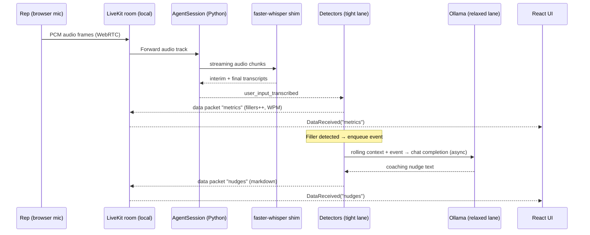

# Research: LiveKit Agents SDK (Deep Dive)

**Scope:** Evaluate the LiveKit Agents Python SDK as the orchestration layer for our **one-way rep-audio practice coach**, with a focus on the `<500 ms` on-CPU constraint and the two-lane (tight detector lane + relaxed LLM lane) architecture.

**Date:** 2026-05-07

---

## 1. What the LiveKit Agents SDK is

The LiveKit Agents SDK is a **Python (and Node.js) framework for building realtime AI participants in LiveKit rooms**. An "agent" is a server-side program that joins a LiveKit room and can consume/produce audio, video, text, and data packets over WebRTC.

It provides first-class abstractions for:

- **`Agent`** — declarative instructions + hooks.
- **`AgentSession`** — orchestrates an STT → (VAD) → LLM → TTS pipeline. All four slots are **optional**, meaning we can run **STT + VAD only** with no LLM or TTS (critical for our one-way, no-bot-talks-back design).
- **`AgentServer`** — job / session lifecycle: connects to a LiveKit server, waits for dispatch, boots a subprocess per room.
- **Plugins** — STT, LLM, TTS, VAD, turn detection. Notable: the `openai` plugin works against **any OpenAI-compatible endpoint**, including local **Ollama** and local `llama-server`. `silero.VAD` runs locally.

Sources:
- LiveKit Agents introduction — <https://docs.livekit.io/agents/>
- Voice AI quickstart — <https://docs.livekit.io/agents/start/voice-ai/>
- Python API reference — <https://docs.livekit.io/python/livekit/agents/index.html>
- Agents GitHub — <https://github.com/livekit/agents>

---

## 2. The Transcriber recipe — closest match for our P0

LiveKit publishes an official **Transcriber** recipe that demonstrates an **STT-only agent with no TTS and no LLM on the critical path**. The agent subscribes to `user_input_transcribed` events and logs final transcripts with timestamps.

Key excerpts from <https://docs.livekit.io/reference/recipes/transcriber/>:

```python
session = AgentSession(
    stt=inference.STT(model="deepgram/nova-3-general"),
)

@session.on("user_input_transcribed")
def on_transcript(transcript):
    if transcript.is_final:
        timestamp = datetime.datetime.now().strftime("%Y-%m-%d %H:%M:%S")
        with open("user_speech_log.txt", "a") as f:
            f.write(f"[{timestamp}] {transcript.transcript}\n")
```

**Why this matters for our project:** Our P0 is essentially this recipe **+ custom detectors on the transcript stream + LLM-generated coaching nudges pushed back to the frontend as data packets**. We do not need `tts` or `llm` slots wired into the `AgentSession`; the coaching LLM runs asynchronously in the "relaxed lane" and publishes nudges via RPC/data channels.

> **Important:** The recipe uses `inference.STT(model="deepgram/...")` which goes through LiveKit Cloud Inference. We will **replace** this with a local-STT path (see §5 and the separate `local-asr.md` doc).

---

## 3. Event surface for the tight lane

The `AgentSession` is an `EventEmitter` with hooks we can wire detectors into:

| Event | When it fires | Use in our system |
|-------|---------------|-------------------|
| `user_input_transcribed` | On partial and final transcripts from STT | Primary driver of tight-lane detectors (fillers, WPM, prohibited phrases) |
| VAD events (via `silero.VAD`) | Speech start / speech end with timestamps | Dead-air detection, session "started speaking" trigger |
| `agent_state_changed` | Pipeline state transitions | Debugging / UI status |
| Room events (via `ctx.room`) | Participant connected, data received, track published | Session bookkeeping; our UI-side config updates come in via data channels |

`livekit.agents.stt` exposes **`SpeechEvent`** objects with `type` (`INTERIM_TRANSCRIPT` / `FINAL_TRANSCRIPT` / `START_OF_SPEECH` / `END_OF_SPEECH`), `alternatives[]`, and timing. We use `INTERIM_TRANSCRIPT` for near-realtime filler detection without waiting for finals.

Sources:
- `livekit.agents.stt` reference — <https://docs.livekit.io/python/livekit/agents/stt/index.html>
- Events and error handling — <https://docs.livekit.io/reference/agents/events/>

---

## 4. Getting data **from the agent to the frontend** (nudges + metric updates)

LiveKit provides multiple mechanisms for agent→frontend data. For our continuous nudge stream + metric counters, **data packets** and **RPC** are the relevant primitives.

| Mechanism | Best for | Notes |
|-----------|----------|-------|
| **Data packets** (`room.localParticipant.publishData`) | Fire-and-forget, low-latency JSON blobs (metrics, nudges) | Reliable or lossy; we use reliable for nudges |
| **Text streams** (`room.localParticipant.streamText`) | Streaming strings (like LLM token streams) | Built-in support for streamed narrative; could push the markdown summary at end-of-session |
| **RPC** (`localParticipant.performRpc`) | Request/response, strongly-typed | Good for control-plane calls from UI → agent (e.g., "set dead-air threshold to 2s") |

The official community answer for "send data from Python agent to React frontend" recommends **RPC** for directed messages and **data packets** for event streams. Our design:

- **Agent → Frontend:** `publishData(channel="nudges", payload=json_bytes)` for each nudge, and `publishData(channel="metrics", payload=json_bytes)` for periodic metric snapshots. Frontend subscribes with `room.on(RoomEvent.DataReceived, ...)`.
- **Frontend → Agent:** RPC calls for UI-side controls:
  - `rpc.start_session(script_id)`
  - `rpc.stop_session()`
  - `rpc.update_settings({dead_air_s: 2.5, prohibited_phrases: [...]})`

Sources:
- Data packets — <https://docs.livekit.io/transport/data/packets/>
- RPC — <https://docs.livekit.io/transport/data/rpc/>
- Community: "How to send data from Python agent to React frontend" — <https://community.livekit.io/t/how-to-send-data-from-python-agent-to-react-frontend-for-navigation/164>

---

## 5. Plugging in fully-local models

### 5.1 Local STT

The SDK's `stt.STT` is an abstract base class. We have three options, in decreasing effort / increasing control:

1. **Adapter behind an OpenAI-compatible STT API.** Run `faster-whisper` behind a small OpenAI-compatible shim (e.g., `vox-box`, `whisper-asr-webservice`, `speaches`, or a hand-rolled FastAPI wrapper). Then use `openai.STT(base_url="http://localhost:8000/v1", model="Systran/faster-whisper-base.en")`. Used by `ShayneP/local-voice-ai` (Whisper profile) and `dwain-barnes/simli-kokoro-whisper-livekit`.
2. **Custom `STT` plugin** — subclass `stt.STT` / `stt.SpeechStream` and call `faster-whisper` directly on streamed PCM frames. More code but tighter latency and no HTTP hop.
3. **Off-the-shelf WhisperLiveKit integration** — `QuentinFuxa/WhisperLiveKit` wraps real-time Whisper for LiveKit specifically; worth evaluating but adds another moving part.

**Recommendation for P0 (updated per P0-lean decision):** **Option 2** — `faster-whisper` embedded in-process via a custom thin `STT` subclass. Eliminates the STT Docker container, removes an HTTP hop, and reduces the service count by one. Implementation details in `local-asr.md`.

### 5.2 Local LLM (relaxed lane)

The `openai` plugin explicitly lists **Ollama** among supported OpenAI-compatible endpoints. The LiveKit plugin docs note:

> Fireworks, Perplexity, Telnyx, xAI, **Ollama**, DeepSeek, OpenRouter, and OVHcloud AI Endpoints.

(Source: <https://docs.livekit.io/python/livekit/plugins/openai/index.html>)

This means we can do:

```python
from livekit.plugins import openai
coaching_llm = openai.LLM(
    base_url="http://localhost:11434/v1",
    api_key="ollama",  # ignored by Ollama
    model="qwen2.5:3b-instruct-q4_K_M",
)
```

Since we are not wiring the LLM into `AgentSession` (it would serialize on the voice turn path), we call it **directly from our own async task** on a rolling-window schedule. The SDK's `openai.LLM` is usable standalone via `llm.chat(...)`.

Alternatives: `llama-cpp`'s `llama-server` also exposes an OpenAI-compatible API (used by `local-voice-ai`). Swappable.

### 5.3 VAD

`silero.VAD` runs fully local, CPU-friendly (ONNX model, tens of MB). Used by every local reference project I've seen. It emits start/end-of-speech events that feed **dead-air** detection directly.

---

## 6. Proposed high-level architecture

```mermaid
flowchart TB
    subgraph Browser["Browser (React + Vite + @livekit/components-react)"]
        UI[Script Panel<br/>Nudge Stream<br/>Metrics Counters<br/>Live Transcript<br/>Download Button]
        Mic[Microphone Track]
    end

    subgraph LKServer["LiveKit server (livekit-server --dev, local)"]
        Room[(WebRTC Room)]
    end

    subgraph Agent["Python Agent (LiveKit Agents SDK)"]
        direction TB
        Session[AgentSession<br/>stt + vad<br/>NO llm/tts]
        subgraph TightLane["Tight lane (<500 ms)"]
            Det[Detectors<br/>fillers · WPM · dead air<br/>prohibited phrases · sentiment]
        end
        subgraph RelaxedLane["Relaxed lane (async)"]
            Nudger[LLM Nudge Worker<br/>rolling window + event triggers]
            Summarizer[End-of-session<br/>Summary Writer]
        end
    end

    subgraph Local["Local services"]
        FW[faster-whisper<br/>OpenAI-compatible shim<br/>base.en, int8]
        Oll[Ollama<br/>small instruct model<br/>e.g. Qwen 2.5 3B Q4]
        Emb[Embedding model<br/>for prohibited phrases]
    end

    Mic -- WebRTC audio --> Room
    Room -- audio track --> Session
    Session -- streaming HTTP /v1/audio/transcriptions --> FW
    FW -- partial + final transcripts --> Session
    Session -- user_input_transcribed events --> Det
    Det -- events --> Nudger
    Det -- periodic window --> Nudger
    Nudger -- /v1/chat/completions --> Oll
    Det -- semantic match --> Emb
    Det -- data packet channel=metrics --> Room
    Nudger -- data packet channel=nudges --> Room
    Summarizer -- text stream "summary" --> Room
    Room -- metric + nudge data packets --> UI
    UI -- RPC start/stop/update-settings --> Session
```

### Data flow (one rep-spoken phrase)



---

## 7. Mapping our P0 requirements to the SDK

| Requirement | SDK mechanism | Notes |
|---|---|---|
| One-way rep audio, no AI speaking back | `AgentSession(stt=..., vad=...)` — omit `llm` and `tts` | Same pattern as the Transcriber recipe |
| Start/Stop session from UI | RPC: `rpc.start_session(script_id)` / `rpc.stop_session()` | Agent can be long-lived per-room; session is explicit on top |
| Filler / WPM / prohibited phrase / sentiment detectors | Custom handlers on `user_input_transcribed` events | Runs in-process, tight latency |
| Dead air (default 3 s, configurable) | Subscribe to Silero VAD start/end events; timer between end → next start | RPC to update threshold |
| Script-bound practice session | UI owns script state; agent receives script via RPC for context only (not used for STT) | Script text is shown in the UI |
| Continuous streaming UI feedback | `publishData(channel="metrics" \| "nudges")` every event + periodic | Reliable data packets |
| LLM coaching nudges | Custom async worker calling `openai.LLM` against Ollama | Does not block STT pipeline |
| Downloadable markdown summary | Collect all events + call LLM for narrative; publish via text stream or data packet on `stop_session` | Generated locally, downloaded by browser |
| Prohibited phrases user-configurable | UI posts list via RPC `update_settings`; detector uses exact + fuzzy + embeddings | Embeddings via local model |
| `<500 ms` latency target | Detectors run in-process on `user_input_transcribed`; no LLM on critical path | LLM nudges can be 1–3 s later |

---

## 8. Why this maps cleanly (and risks to watch)

### Cleanly supported
- STT-only sessions are officially supported and demonstrated.
- Event-driven processing on transcripts is idiomatic.
- Data packets / RPC give us exactly the primitives we need for bidirectional UI communication without inventing our own websocket layer.
- Silero VAD is first-class and local.
- Ollama is a first-class LLM backend via the `openai` plugin.

### Risks
1. **Local STT hop latency.** The OpenAI-compatible shim over `faster-whisper` adds HTTP/serialization overhead. If `<500 ms` is not achievable, we write a custom `STT` plugin. Mitigation: prototype early.
2. **CPU contention.** Silero VAD + `faster-whisper` + `Ollama` all want CPU. With a single consumer laptop, the relaxed lane's LLM call can starve the tight lane if we're not careful. Mitigation: bound LLM worker concurrency to 1; use nice/priority if needed; keep Ollama model small (≤3B, Q4 quantized).
3. **LiveKit Agents SDK is opinionated around voice turn-taking.** Our "rep speaks for 2 minutes straight" scenario is unusual. We need to verify that turn detection doesn't cut the rep off mid-script; in the Transcriber recipe there's no turn detection configured, which is what we want.
4. **Browser mic capture with WebRTC** adds complexity compared to simple `getUserMedia` + websocket. But LiveKit buys us robust audio transport, echo cancellation hooks, noise suppression, and a well-tested React SDK — worth it given LiveKit is a firm requirement.

---

## 9. Recommendation

**Use the LiveKit Agents Python SDK as our orchestration layer, following the Transcriber recipe pattern as a starting point.** Configure `AgentSession` with `stt=<local-whisper>` and `vad=silero.VAD.load()`, omit `llm` and `tts`, and implement the tight-lane detectors as event handlers plus a relaxed-lane async worker that calls Ollama directly. Push nudges and metrics to the frontend via data packets; accept UI commands via RPC.

---

## 10. Key references

- LiveKit Agents docs home — <https://docs.livekit.io/agents/>
- Transcriber recipe (closest P0 match) — <https://docs.livekit.io/reference/recipes/transcriber/>
- Voice AI quickstart — <https://docs.livekit.io/agents/start/voice-ai/>
- Self-host locally — <https://docs.livekit.io/transport/self-hosting/local/>
- Python API reference — <https://docs.livekit.io/python/livekit/agents/index.html>
- Agents GitHub — <https://github.com/livekit/agents>
- `openai` plugin (Ollama support) — <https://docs.livekit.io/python/livekit/plugins/openai/index.html>
- Data packets — <https://docs.livekit.io/transport/data/packets/>
- RPC — <https://docs.livekit.io/transport/data/rpc/>
- Python agent starter template — <https://github.com/livekit-examples/agent-starter-python>
- Local reference project (all-local stack) — <https://github.com/ShayneP/local-voice-ai>
- Local reference project (Whisper + Kokoro + Ollama) — <https://github.com/dwain-barnes/simli-kokoro-whisper-livekit>
- Real-time local Whisper for LiveKit — <https://github.com/QuentinFuxa/WhisperLiveKit>
- `faster-whisper` — <https://github.com/SYSTRAN/faster-whisper>
